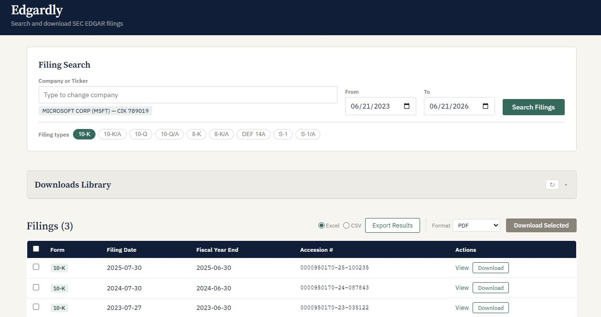
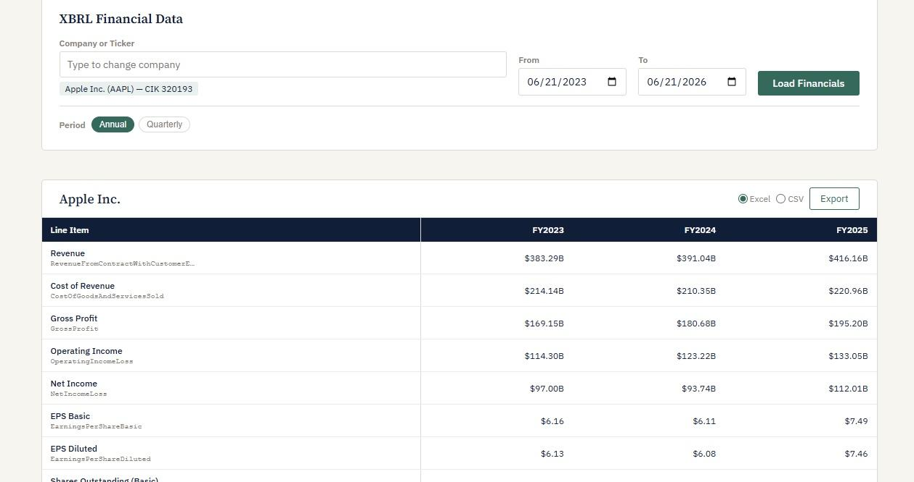
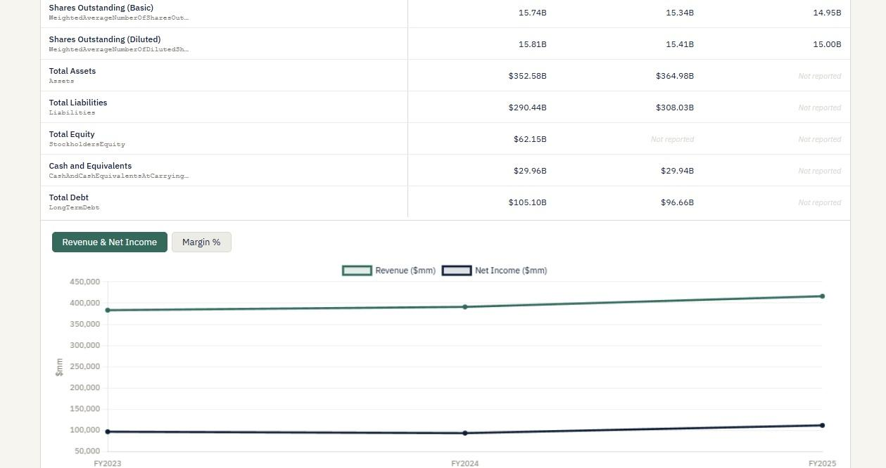
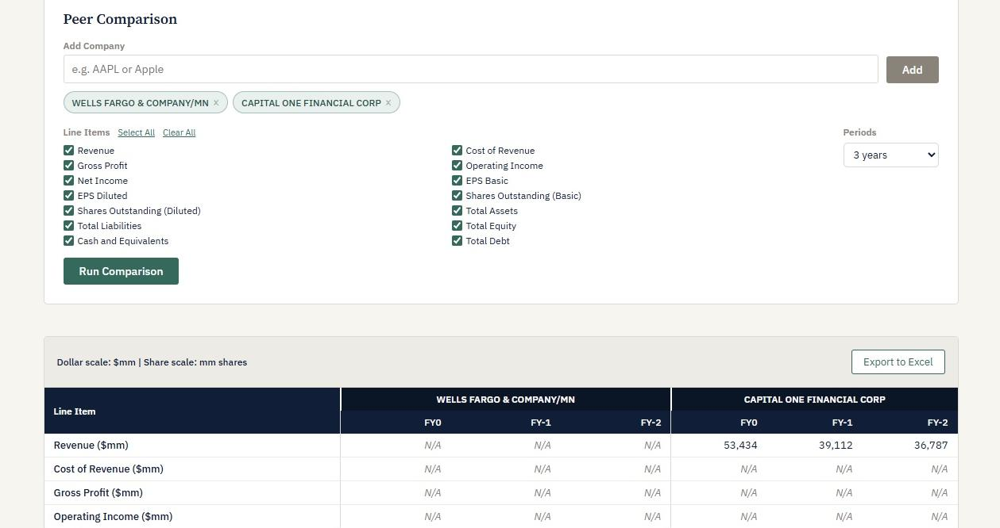

# Edgardly

**A free, local tool for searching, downloading, and extracting structured financial data from SEC EDGAR filings.**

---

## Overview

SEC EDGAR makes every public company's filings available for free, but its interface was built for compliance lookup, not financial research. Finding a specific set of filings across companies, downloading them in bulk, and extracting structured financial data into a format useful for modeling requires stitching together multiple tools, paid data vendors, or a significant amount of custom scripting.

Edgardly runs entirely on your machine and requires no API keys, no paid subscriptions, and no data sent to third-party services. It provides filing search across the full EDGAR universe, bulk download with format options, and direct extraction of structured XBRL financial data, so you can get from a company name to a source-tagged historical dataset ready to drop into a model, without leaving your local environment.

---

## Features

- **Filing search:** look up a company by name or ticker, then filter its filings by form type and date range. Supports 10-K, 10-K/A, 10-Q, 10-Q/A, 8-K, 8-K/A, DEF 14A, S-1, and S-1/A filing types. Companies not in the local ticker cache (recent IPOs, name changes, some foreign filers) are resolved through EDGAR full-text search as a fallback.

- **Bulk download:** download individual filings or full result sets as HTML, PDF, or both. PDF conversion uses Playwright/headless Chromium for high-fidelity rendering; when a native PDF is available directly from EDGAR, it is used instead.

- **Persistent downloads library:** a local library panel tracks all previously downloaded filings, organized by company and fiscal year, with search/filter and direct file access.

- **Filing metadata export:** export search results as CSV or Excel with accession numbers, filing dates, form types, CIK, SIC code and description, SEC filer category, and direct EDGAR links.

- **XBRL structured financial data extraction (single-company):** extract financial statement line items directly from SEC XBRL data, with full source-tag transparency for every value. Extracted line items include:
  - Revenue, Cost of Goods Sold, Gross Profit, Operating Income, Net Income
  - Basic and Diluted EPS, Shares Outstanding
  - Total Assets, Total Liabilities, Total Equity
  - Cash and Equivalents, Long-Term Debt

- **Automated validation flags:** an independent validation layer checks extracted values for common data issues: negative revenue, balance sheet equation mismatches (Assets ≠ Liabilities + Equity), EPS-to-net-income reconciliation discrepancies, and extreme year-over-year changes. Flagged values are surfaced visually with full context; they are never silently hidden, auto-corrected, or excluded from exports.

- **Peer comparison:** run side-by-side XBRL data extraction across a user-defined comp set. Results are aligned by relative fiscal year (FY0, FY-1, FY-2, and so on) rather than by calendar date, so companies with different fiscal year ends line up correctly, and every value in the table is scaled consistently. Validation flags carry through to the peer view.

- **Interactive charts:** revenue/net income trends and margin analysis (gross margin %, net margin %) for both single-company and peer comparison views. Charts use explicit gaps for missing data points rather than interpolating across them, and render flagged data points with a distinct visual marker rather than suppressing them.

- **Excel export with native charts:** exports from the XBRL and peer comparison views produce formatted Excel workbooks with: native Excel charts, accounting number formats with negatives in parentheses, color coding that distinguishes values pulled from XBRL (blue) from flagged values (red) and values the company did not report (grey italic), frozen panes, and a source-tag reference sheet mapping each line item to the XBRL concept it was drawn from.

---

## Why This Exists / Design Philosophy

Edgardly was built around a few principles that came directly from the frustrations of working with EDGAR data in practice.

**Source-tag transparency.** Every extracted financial value shows exactly which XBRL tag produced it (e.g. `us-gaap/Revenues`, `us-gaap/RevenueFromContractWithCustomerExcludingAssessedTax`). Companies and eras use different tags for the same concept; hiding that variation behind a clean label trades transparency for false confidence. Edgardly surfaces the tag so you always know what you're actually looking at.

**Never silently fix ambiguous data.** When a value looks suspicious (a revenue figure that's negative, a balance sheet that doesn't balance, an EPS that doesn't reconcile to net income), the right response is to flag it clearly, not to quietly exclude it from output or apply a heuristic correction. Edgardly's validation layer marks anomalies visibly and preserves the underlying values exactly as extracted in all views and exports.

**Explicit handling of real EDGAR quirks.** EDGAR data is not a clean, uniform API. Tag names change across filing eras. Companies restate prior periods in amendment filings. Fiscal year end dates shift. Values that are genuinely zero are structurally different from values that were simply not reported. Edgardly tries to handle these explicitly rather than papering over them, making the behavior predictable even when the underlying data is not.

---

## Screenshots

### Filing Search

<!-- [SCREENSHOT: Filing search panel showing multi-filter search with company autocomplete, SIC code/sector selector, filer category chips, date range inputs, and results table with form type badges and download actions] -->



### XBRL Single-Company View





### Peer Comparison




---

## Requirements

- Python 3.9+
- [Playwright](https://playwright.dev/python/) (for PDF conversion via headless Chromium)
- Dependencies listed in `requirements.txt`

---

## Installation

### Windows

```bat
git clone https://github.com/thekeoni1/edgardly.git
cd edgardly\app
python -m venv venv
venv\Scripts\activate
pip install -r requirements.txt
playwright install chromium
```

### macOS

```bash
git clone https://github.com/thekeoni1/edgardly.git
cd edgardly/app
python3 -m venv venv
source venv/bin/activate
pip install -r requirements.txt
playwright install chromium
```

> **Note:** Use `python3` (not `python`) on macOS before the virtual environment is activated. Once the venv is active, `python` and `pip` will work as expected.

### Troubleshooting: virtual environment errors

If you encounter a "bad interpreter" error or other virtual environment issues, delete the venv folder and start fresh:

```bash
# macOS / Linux
rm -rf venv

# Windows
rmdir /s venv
```

Then re-run the `python3 -m venv venv` (or `python -m venv venv` on Windows) step and continue from there.

---

## Running

**Option 1: double-click launcher (simplest, no terminal needed)**

- **Windows:** double-click `run.bat` in the project root
- **Mac:** right-click `run.command` → **Open** the first time

  > On Mac, double-clicking `run.command` will be blocked by macOS Gatekeeper with an "unidentified developer" warning because the file isn't code-signed. Right-clicking and selecting **Open** bypasses this once; subsequent launches can be double-clicked normally. You can also run `chmod +x run.command` in Terminal first if preferred.

The browser will open automatically to [http://localhost:5050](http://localhost:5050) when the server is ready. The terminal window stays open so you can see any errors.

**Option 2: command line**

```bash
# from the edgardly/app directory, with venv activated:
python app.py
```

Open [http://localhost:5050](http://localhost:5050) in your browser.

---

## Tests

The test suite lives in `app/tests/` and runs with pytest from the `app` directory:

```bash
# from the edgardly/app directory, with venv activated:
python -m pytest -m "not integration"
```

Most tests are fully mocked and need no network access. Tests marked `integration` hit the
live SEC EDGAR API or start a real browser, so they are slower and require a connection; run
the whole suite with `python -m pytest` when you want those too.

---

## Data Sources

All data is sourced directly from SEC EDGAR public APIs:

- **Filing search:** [EDGAR full-text search (EFTS)](https://efts.sec.gov) and the [EDGAR submissions API](https://data.sec.gov/submissions/)
- **XBRL data:** [EDGAR company facts API](https://data.sec.gov/api/xbrl/companyfacts/)
- **No third-party data vendors.** No Bloomberg, Refinitiv, or similar.

This tool uses EDGAR's public APIs in accordance with SEC rate-limiting guidelines (10 requests/second maximum with a compliant `User-Agent` header).

---

## License

MIT. See [LICENSE](LICENSE) for details.
