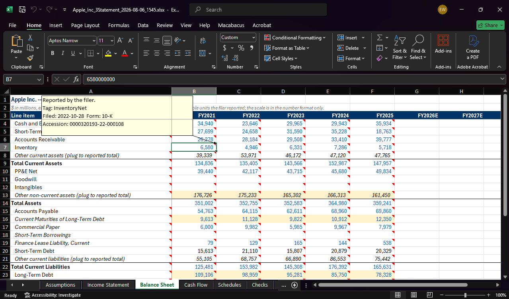
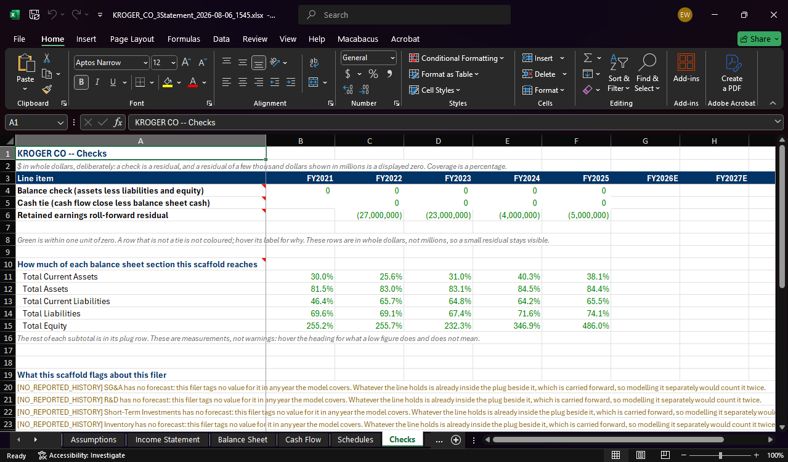
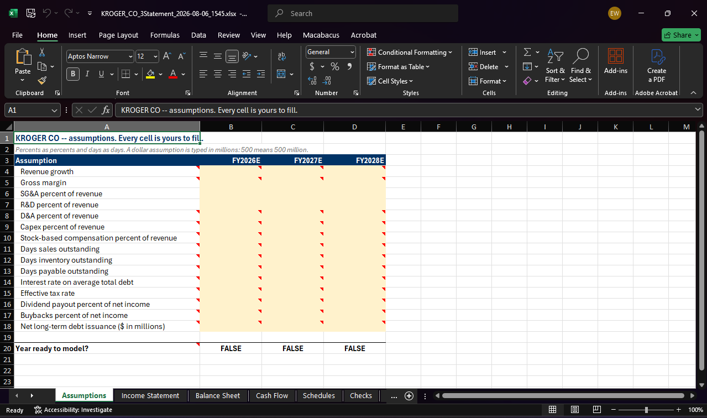
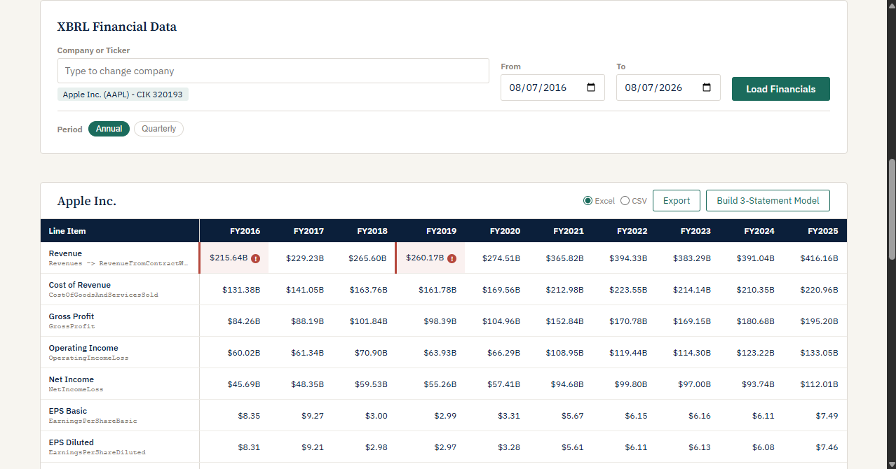
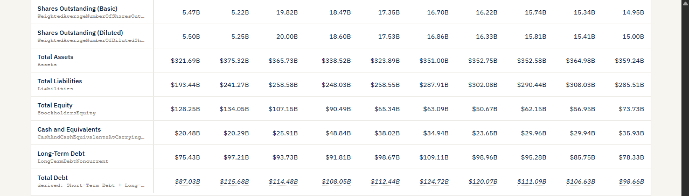
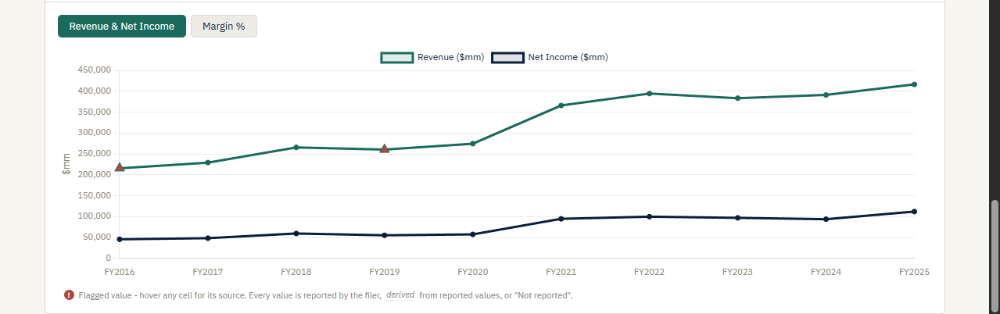
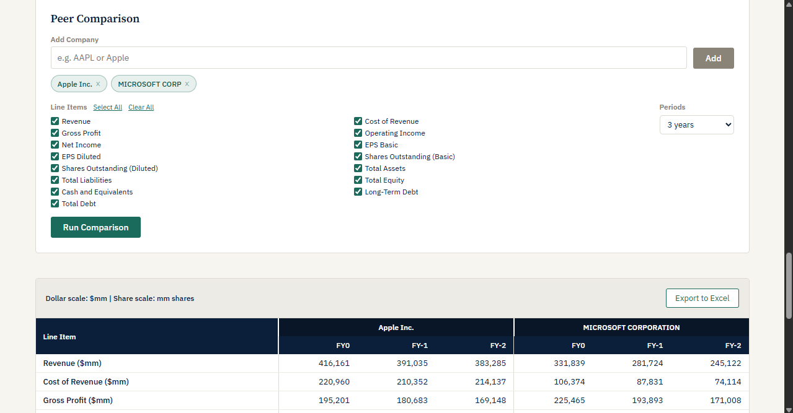
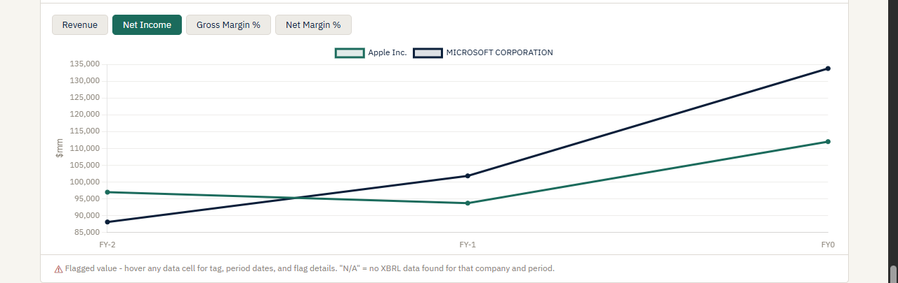

# Edgardly

**A free, local tool that turns SEC EDGAR filings into structured financial data and a linked three-statement Excel model.**

---

## Overview

SEC EDGAR makes every public company's filings available for free, but its interface was built for compliance lookup, not financial research. Finding a specific set of filings across companies, downloading them in bulk, and extracting structured financial data into a format useful for modeling requires stitching together multiple tools, paid data vendors, or a significant amount of custom scripting.

Edgardly runs entirely on your machine and requires no API keys, no paid subscriptions, and no data sent to third-party services. It provides filing search across the full EDGAR universe, bulk download with format options, extraction of structured XBRL financial data, and a three-statement model scaffolder that builds the mechanical skeleton of a standard Excel model from a company's own filings. Every judgment input is left blank for the analyst: Edgardly never fills in an assumption, a forecast, or a value nobody reported.

---

## Features

- **Three-statement model scaffolder:** builds a seven-sheet Excel workbook for one filer (Assumptions, Income Statement, Balance Sheet, Cash Flow, Schedules, Checks, Source Tags). It carries five fiscal years of historicals taken only from the company's annual reports: a figure that no 10-K presents is left as a flagged blank rather than filled from a 10-Q comparative. Three forecast columns are wired to the Assumptions sheet and stay blank until you fill it, because each forecast year is guarded by a readiness cell that is true only when its inputs and every earlier year's are entered. Where a filer's tagged components do not sum to the subtotal it reports, the gap is written as a visible plug row with a live formula, never as a filled number.

- **Provenance on every cell:** blue for a value the filer reported, black for one Edgardly derived, grey italic for one nobody tagged. Every value carries a cell comment naming the XBRL tag and the filing behind it, and derived cells are live Excel formulas over other cells rather than pasted numbers, so the workbook shows its own working down to the reported values it stands on. A cross-sheet reference is green, the standard modeling convention.

- **Checks sheet:** the balance sheet tie, the cash flow close against balance sheet cash, and the retained earnings roll-forward residual, one column per year and written as live arithmetic. It also carries the per-section coverage percentages for the balance sheet, showing how much of each reported subtotal the tagged line items account for, and a grouped list of every flag the workbook raises about that filer's data.

- **Scope gate:** banks and insurance carriers (by SIC range), companies whose tagged statements have a financial institution's shape, and IFRS-only filers are refused a scaffold with a message saying why. No partial workbook is written. The refusal governs the scaffolder only: the filing search, the XBRL table, and the peer comparison still read whatever those companies tag.

- **Displayed in millions:** dollar and share cells display in millions through the Excel number format while storing the whole units the filer reported, so a provenance comment stays true and a check stays exact to the dollar. Check rows keep whole dollars, because a residual of a few thousand dollars shown in millions is a displayed zero.

- **Filing search:** look up a company by name or ticker, then filter its filings by form type and date range. Supports 10-K, 10-K/A, 10-Q, 10-Q/A, 8-K, 8-K/A, DEF 14A, S-1, and S-1/A. Companies not in the local ticker cache (recent IPOs, name changes, some foreign filers) are resolved through EDGAR full-text search as a fallback.

- **Bulk download:** download individual filings or full result sets as HTML, PDF, or both. PDF conversion uses Playwright and headless Chromium; when a native PDF is available directly from EDGAR, it is used instead.

- **Persistent downloads library:** a local library panel tracks previously downloaded filings, organized by company and fiscal year, with search/filter and direct file access.

- **Filing metadata export:** export search results as CSV or Excel with company name, ticker, CIK, form type, filing date, fiscal year end, accession number, SIC code and description, SEC filer category, document URL, and an amendment flag.

- **XBRL structured financial data extraction (single-company):** extract financial statement line items directly from SEC XBRL data, with per-value source-tag transparency. The extracted line items are:
  - Revenue, Cost of Revenue, Gross Profit, Operating Income, Net Income
  - EPS Basic, EPS Diluted, Shares Outstanding (Basic), Shares Outstanding (Diluted)
  - Total Assets, Total Liabilities, Total Equity
  - Cash and Equivalents, Long-Term Debt, Total Debt

  Two of those are not read straight from a tag. Total Debt is arithmetic, because no filer reports it: Edgardly sums the filer's short-term and long-term debt, and leaves the row blank when either is missing rather than treating an absent balance as zero. Gross Profit comes from a tag when the filer reports one and falls back to revenue less cost of revenue only for periods where nobody tagged it.

- **Automated validation flags:** an independent validation layer checks extracted values for common data issues: negative revenue, net income exceeding revenue, balance sheet equation mismatches, EPS-to-net-income reconciliation discrepancies, extreme year-over-year changes, and a change of XBRL tag mid-series. Flagged values are surfaced visually with full context; they are never silently hidden, auto-corrected, or excluded from exports.

- **Peer comparison:** run side-by-side XBRL extraction across a comp set you define. Results are aligned by relative fiscal year (FY0, FY-1, FY-2, and so on) rather than by calendar date, so companies with different fiscal year ends line up correctly, and every value in the table is scaled consistently. Validation flags carry through to the peer view.

- **Interactive charts:** revenue and net income trends and margin analysis (gross margin %, net margin %) for both the single-company and peer views. Charts leave explicit gaps for missing data points rather than interpolating across them, and render flagged points with a distinct marker rather than suppressing them.

- **Excel export with native charts:** exports from the XBRL and peer comparison views produce formatted workbooks with native Excel charts, accounting number formats with negatives in parentheses, frozen panes, a source-tag reference sheet giving one line per value, and the same color coding the scaffolder uses: blue for a value the filer reported, black for one Edgardly derived, grey italic for one nobody reported, and red for a value the validation layer flagged.

---

## Why This Exists / Design Philosophy

Edgardly was built around a few principles that came directly from the frustrations of working with EDGAR data in practice.

**Source-tag transparency.** Every extracted financial value shows exactly which XBRL tag produced it (e.g. `us-gaap/Revenues`, `us-gaap/RevenueFromContractWithCustomerExcludingAssessedTax`). Companies and eras use different tags for the same concept; hiding that variation behind a clean label trades transparency for false confidence. Edgardly surfaces the tag so you always know what you are actually looking at.

**Never guess a number.** A value Edgardly cannot source or compute from reported values is shown as missing, with a pointer to the statement and filing where a reader can find it by hand. A derivation is arithmetic on reported values of the same period, and it ships with its formula. Nothing is interpolated, back-filled, or rounded into place.

**Never silently fix ambiguous data.** When a value looks suspicious (a negative revenue figure, a balance sheet that does not balance, an EPS that does not reconcile to net income), the right response is to flag it clearly, not to quietly exclude it or apply a heuristic correction. Edgardly marks anomalies visibly and preserves the underlying values exactly as extracted in all views and exports.

**Explicit handling of real EDGAR quirks.** EDGAR data is not a clean, uniform API. Tag names change across filing eras. Companies restate prior periods in amendments. Fiscal year ends shift, and a filer's own name for a fiscal year need not match its calendar year. A period label EDGAR stamps on a filing is not a fact about the value inside it. Edgardly handles these explicitly rather than papering over them, making the behavior predictable even when the underlying data is not.

**Say no rather than produce something meaningless.** A bank's balance sheet does not fit a standard three-statement template, and an IFRS filer tags nothing Edgardly reads. Both get a refusal that explains itself instead of a workbook whose rows do not mean what they say.

---

## Screenshots

### Three-Statement Model Scaffold



Every reported value carries a note naming the tag, form, and accession it came from. The cell displays 6,580 while the formula bar holds the raw 6,580,000,000, because the scaling to millions lives in the number format only.



The Checks sheet states how much of the filer the scaffold actually reaches and what it could not model.



Assumptions ship empty. The scaffold reports each forecast year as not ready until you fill them in.

### Filing Search


### XBRL Single-Company View



Each line item names the tag that produced it, and a row whose tag changed mid-period shows both.



Total Debt is derived from short-term plus long-term debt, and renders in italics beside the reported Long-Term Debt row to keep the two apart.



Flagged values keep their place on the chart and are marked with a triangle rather than dropped.

### Peer Comparison





Four metric tabs switch the chart between Revenue, Net Income, Gross Margin, and Net Margin.

---

## Requirements

- Python 3.9+
- [Playwright](https://playwright.dev/python/) (for PDF conversion via headless Chromium)
- Dependencies listed in `app/requirements.txt`

---

## Installation

### Windows

```bat
git clone https://github.com/thekeoni1/edgardly.git
cd edgardly\app
python -m venv venv
venv\Scripts\activate
pip install -r requirements.txt
playwright install chromium
```

### macOS

```bash
git clone https://github.com/thekeoni1/edgardly.git
cd edgardly/app
python3 -m venv venv
source venv/bin/activate
pip install -r requirements.txt
playwright install chromium
```

> **Note:** Use `python3` (not `python`) on macOS before the virtual environment is activated. Once the venv is active, `python` and `pip` will work as expected.

### Troubleshooting: virtual environment errors

If you encounter a "bad interpreter" error or other virtual environment issues, delete the venv folder and start fresh:

```bash
# macOS / Linux
rm -rf venv

# Windows
rmdir /s venv
```

Then re-run the `python3 -m venv venv` (or `python -m venv venv` on Windows) step and continue from there.

---

## Running

**Option 1: double-click launcher (simplest, no terminal needed)**

- **Windows:** double-click `run.bat` in the project root
- **Mac:** right-click `run.command` and choose **Open** the first time

  > On Mac, double-clicking `run.command` will be blocked by macOS Gatekeeper with an "unidentified developer" warning because the file is not code-signed. Right-clicking and selecting **Open** bypasses this once; subsequent launches can be double-clicked normally. You can also run `chmod +x run.command` in Terminal first if preferred.

The browser will open automatically to [http://localhost:5050](http://localhost:5050) when the server is ready. The terminal window stays open so you can see any errors.

**Option 2: command line**

```bash
# from the edgardly/app directory, with venv activated:
python app.py
```

Open [http://localhost:5050](http://localhost:5050) in your browser.

---

## Tests

The test suite lives in `app/tests/` and runs with pytest from the `app` directory. Test-only dependencies are in `app/requirements-dev.txt`, which also pulls in `requirements.txt`:

```bash
# from the edgardly/app directory, with venv activated:
pip install -r requirements-dev.txt
python -m pytest -m "not integration"
```

Most tests are fully mocked and need no network access. Tests marked `integration` hit the live SEC EDGAR API or start a real browser, so they are slower and require a connection; run the whole suite with `python -m pytest` when you want those too.

---

## Development record

The v2 work is documented as it happened, in three files:

- [`docs/V2_PLAN.md`](docs/V2_PLAN.md) is the plan: what v2 is, the phases, the risk register, and the exit criteria each phase is measured against.
- [`docs/SESSIONS.md`](docs/SESSIONS.md) holds the session prompts, one per work session.
- [`PROGRESS.md`](PROGRESS.md) is the working log: what actually shipped in each session, what was measured, the settled decisions and the reasons behind them, and the questions each session left open.

The acceptance harness for the scaffolder is in [`docs/acceptance/`](docs/acceptance): a per-company checklist worked against the real 10-Ks, and a log of everything the check turned up.

---

## Data Sources

All data is sourced directly from SEC EDGAR public APIs:

- **Filing search:** [EDGAR full-text search (EFTS)](https://efts.sec.gov) and the [EDGAR submissions API](https://data.sec.gov/submissions/)
- **XBRL data:** [EDGAR company facts API](https://data.sec.gov/api/xbrl/companyfacts/)
- **No third-party data vendors.** No Bloomberg, Refinitiv, or similar.

This tool uses EDGAR's public APIs in accordance with SEC rate-limiting guidelines (10 requests/second maximum with a compliant `User-Agent` header).

---

## License

MIT. See [LICENSE](LICENSE) for details.
